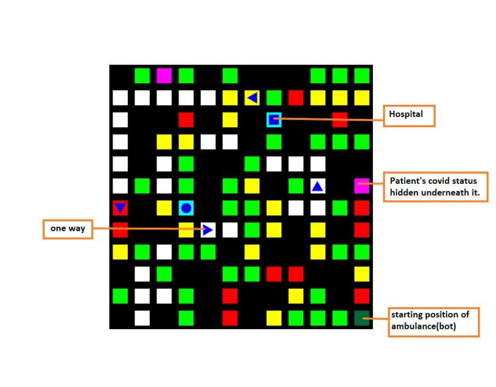
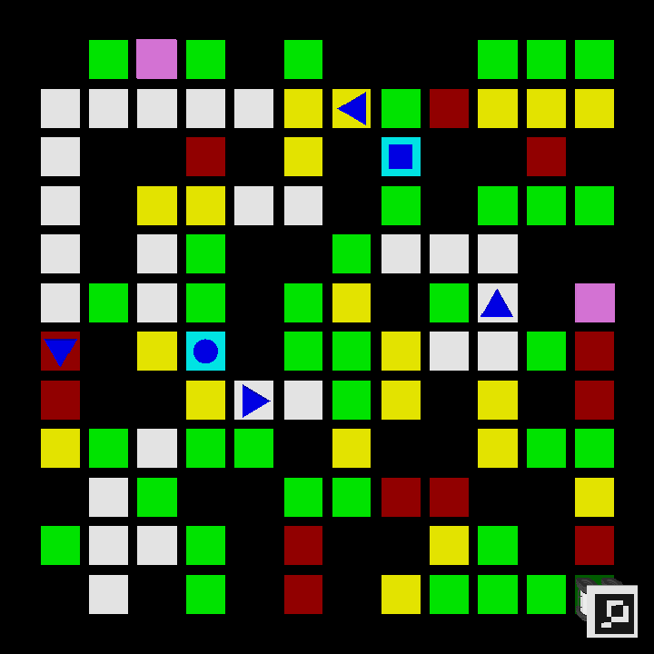
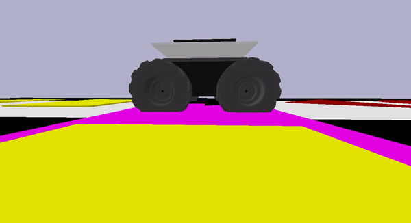

<html>
<body>
    
<h1 align=center>Pixelate'21</h1>
    
<h4 align=center><em>Computer Vision based event organised under Technex'21, IIT (BHU) Varanasi</em></h4> 
    

    
    
     

    
<h3> Problem Statement</h3>
<ul>
    <li>
        The problem is divided into two tasks:
        <ul>
            <li>
                Move the ambulance to the patient locations (pink tiles) inorder to reveal the Covid status of the
                patients, i.e., the patient is having covid symptoms or not having covid symptoms, which are hidden
                underneath that location.
            </li>
            <li>
                Deliver the patients to their respective hospital following the rules described below.
            </li>
        </ul>
    </li>
    <li>
        The arena has different traffic in different places represented by red, yellow, green, white tiles showing
        heavy, intermediate, low, no traffic respectively.
        <ul>
            <li>
                As red tiles are heavy traffic areas so in order to cross one red tile the bot (ambulance) takes 4 units
                of time.
            </li>
            <li>
                The yellow tiles have slightly less traffic than red one hence the ambulance takes 3 units of time to
                cross each tile.
            </li>
            <li>
                The green tiles have low traffic hence the ambulance moves fast and it takes 2 units of time to cross
                each tile.
            </li>
            <li>
                As white tiles have no traffic at all hence the ambulance takes only 1 unit of time to cross each tile.
            </li>
        </ul>
    </li>
    <li>
        As it is a matter of life and death for the patient, the bot (ambulance) needs to take as minimum time as
        possible so it needs to take a path with the lowest value of overall time taken.
    </li>
    <li>
        There are also one-ways (blue triangle shapes on red/yellow/green/white tiles) in the arena. The bot can only
        move in one direction on these tiles represented by the head of the triangular shapes.
    </li>
    <li>
        The bot(ambulance) has to start from lowest right corner (green tile)
    </li>
    <li>
        The bot first needs to move to the patient location (pink tile) following the above rule. The Covid status of
        that patient is hidden underneath it. This step will reveal the covid status of the patient which was earlier
        concealed.
        <ul>
            <li>
                The status symbol of the patient matches with the symbol of the respective hospital (blue square and
                blue circle on light blue tile).
            </li>
        </ul>
    </li>
    <li>
        After knowing the status of the patient, the bot needs to deliver the patient to the respective hospital
        following the rule to take ‘minimum overall time taken path’.
    </li>
    <li>
        The bot needs to stop one node before the patient location in order to reveal the covid status. The path to the
        hospital should start from the patient location (pink tile) i.e. it should move through the pink tile.
    </li>
    <li>
        The bot should also stop one node before the hospital. The path to the next patient’s location should also start
        from the hospital itself.
    </li>
    <li>
        The rule to take ‘minimum overall time taken path’ has to be applied for every motion with keeping track
        ofone-ways.
    </li>
</ul>
    
<h3 align=center> Our Approach </h3>
    
1. We used <b> Computer Vision</b> for <i>image segmentation</i> i.e. extracting shapes of different colors from the arena. Used <b>Dijkstra's</b> algorithm (on a customly designed <i>directed weighted graph</i>) to trace path from the current position of the bot to the destination position Dijkstra's algorithm returned the shortest desired path. <b>Aruco Marker</b> was used to determine the current position of the bot at any instant.  
2. First, a <b>directed weighted graph</b> is created, in which edges are added with their respective weights in accordance with their colour.  
3. <b>Shape</b> and <b>Color</b> in each grid of the arena is detected using several techniques such as masking, and contour approximation. 
4. <b>Four steps</b> are to be executed, viz., reaching the first patient, delivering the first patient to corresponding hospital, reaching the second patient and delivering the second patient to the corresponding hospital.
5. Destination location is determined in all four steps, thereafter, destination location and current location are send to <b>dijsktra class</b> to find the optimal path.
6. A <b>list</b> is created providing the path to be taken by the bot to reach destination. Various custom-made functions, such as <code>travel()</code>, <code>align()</code>, <code>move()</code>, <code>left()</code> and <code>right()</code>, are employed in order to facilitate the movement of the bot.  
8. Video of our run can be found [here](https://drive.google.com/file/d/1oIG1dmQrNCpeDWL4WBTsqhCpQo9Nq6R1/view?usp=sharing)
    
</body>
</html>
